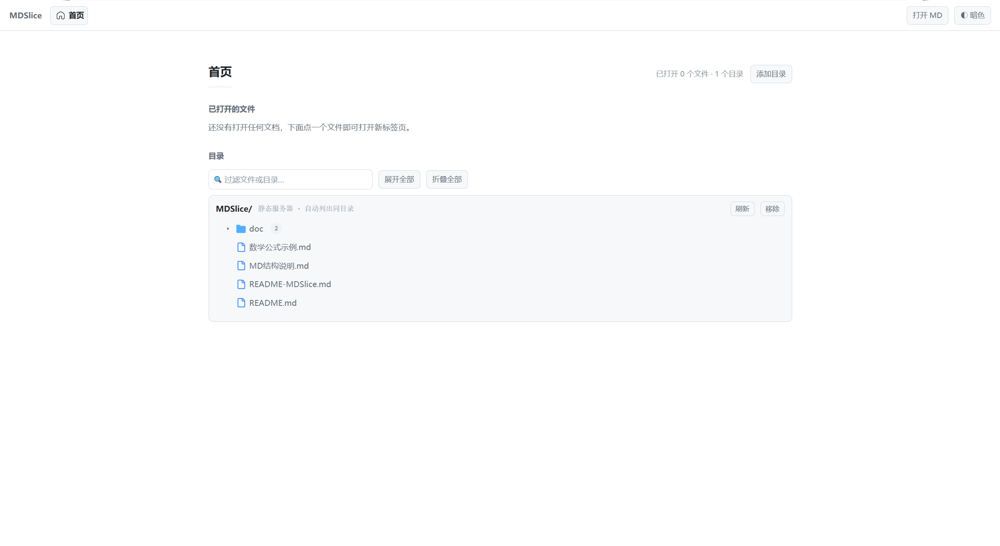
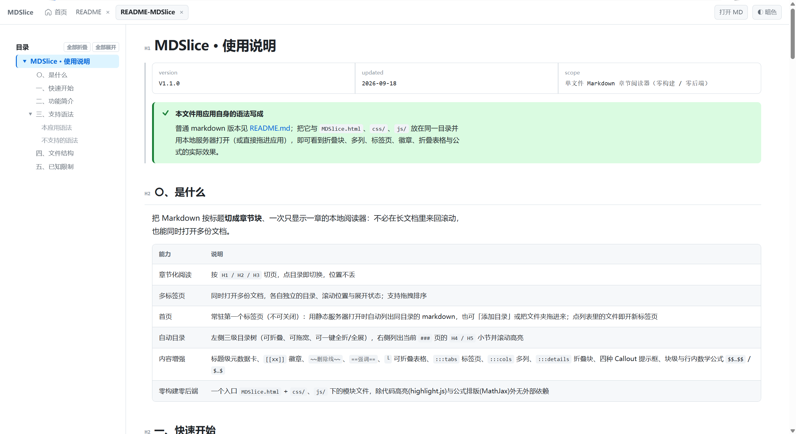

# MDSlice · 使用说明

---
title: MDSlice 使用说明
version: V1.1.0
updated: 2026-09-18
scope: 单文件 Markdown 章节阅读器（零构建 / 零后端）
---

> [!TIP] **本文件用应用自身的语法写成**
> 普通 markdown 版本见 [README.md](README.md)；把它与 `MDSlice.html`、`css/`、`js/` 放在同一目录并用本地服务器打开（或直接拖进应用），即可看到折叠块、多列、标签页、徽章、折叠表格与公式的实际效果。

## 〇、是什么

把 Markdown 按标题**切成章节块**、一次只显示一章的本地阅读器：不必在长文档里来回滚动，也能同时打开多份文档。

| 能力 | 说明 |
|---|---|
| 章节化阅读 | 按 `H1 / H2 / H3` 切页，点目录即切换，位置不丢 |
| 多标签页 | 同时打开多份文档，各自独立的目录、滚动位置与展开状态；支持拖拽排序 |
| 首页 | 常驻第一个标签页（不可关闭）：用静态服务器打开时自动列出同目录的 markdown，也可「添加目录」或把文件夹拖进来；点列表里的文件即开新标签页 |
| 自动目录 | 左侧三级目录树（可折叠、可拖宽、可一键全折/全展），右侧列出当前 `###` 页的 `H4 / H5` 小节并滚动高亮 |
| 内容增强 | 标题级元数据卡、`[[xx]]` 徽章、`~~删除线~~`、`==强调==`、`└` 可折叠表格、`:::tabs` 标签页、`:::cols` 多列、`:::details` 折叠块、四种 Callout 提示框、块级与行内数学公式 `$$…$$` / `$…$` |
| 零构建零后端 | 一个入口 `MDSlice.html` + `css/`、`js/` 下的模块文件，除代码高亮(highlight.js)与公式排版(MathJax)外无外部依赖 |






## 一、快速开始

| 方式 | 操作 | 说明 |
|---|---|---|
|本地打开|双击`MDSlice.html`| 必要文件：`MDSlice.html`、`css/`、`js/` |
|静态服务|在`MDSlice.html`所在目录下启动静态服务器|打开时会自动读取同目录下的所有文档并列出|

**静态服务命令参考**
```bash
python3 -m http.server 8080     # 浏览器访问 http://localhost:8080/MDSlice.html
npx serve -p 8080 -o
npx http-server -p 8080 -o
```

## 二、功能简介

| 功能 | 操作 | 说明 |
|---|---|---|
| 直接打开MD | 顶栏「打开 MD」或直接拖拽`.md`文件进入页面任意位置 | 任意位置的 `.md`，不限制文件名 |
| 打开MD目录 | 在首页点击「添加目录」，或把文件夹拖进页面| 只列出其中的MD和含MD的子文件夹；其他文件、构建 / 缓存目录 都不显示 |
| 打开文档链接 | 点正文里的 `[说明](另一个.md)` | 同源的 `.md` / `.markdown` / `.txt` 链接在应用内新开标签；带 `#片段` 会定位到该章节。外链、跨源、其他后缀保持浏览器默认行为 |

可接受的后缀：`.md` / `.markdown` / `.txt`。

每次打开都是一张新标签页；若同一身份的文件已经开着：从首页列表 / 目录点击会**切过去**，通过正文链接点开则关闭那一页并在**原位置**重新读取。

> [!TIP] `file://` 直开时文档没有来源地址，正文链接按相对路径无法解析成 URL；若目标文件在已「添加目录」的文件夹里，仍会用文件引用打开，否则在页内提示无法定位。


## 三、支持语法

#### markdown基础语法

| 类型 | 语法 |
| --- | --- |
| 标题 | `#`~`######` |
| 强调 | `**粗体**`、`__粗体__`、`*斜体*`、`_斜体_`、`==强调==`、`~~删除~~` |
| 列表 | `-` / `*` / `+` 无序；1. 有序；  `- [ ]` 任务列表；`- [x]` 已完成； 嵌套靠缩进 |
| 引用 | `>` 引用，可多层 |
| 表格 | `\|` 分隔行与列；`-` 分隔表头与内容；`:` 对齐方式|
| 链接 | `[文字](url)` |
| 图片 | ``；用绝对地址或 data URI（相对路径会按页面地址解析） |
| 代码 | `\`\`\``；围栏代码块 lang 可选 |
| 分隔线 | ---、***、___ |
| 转义 | \<特殊字符> |
| **原始HTML** | 仅支持 `<br>` |

#### markdown扩展语法

| 类型 | 语法 |
| --- | --- |
| callout | `> [!INFO]` 等共 12 个别名，归为**四种样式** INFO / TIP / WARNING / DANGER（如 `[!IMPORTANT]`→INFO、`[!CAUTION]`→WARNING、`[!ERROR]`→DANGER）；`> [!NOTE]` 显示为无图标的普通引用 |
| 数学公式 | `$$…$$` 块级公式；`$…$` 行内公式 |

> 公式判定：**`$` 前后必须是空格（包括行首行尾），或六种强调标记（`**` `*` `__` `_` `==` `~~`）**，内容两端不能是空格，不满足时按普通文本处理；`\$` 输出字面美元符。块级公式需整行 `$$…$$` 或 `$$` 单独成行，正文中间夹写的按原文显示。

### 本应用语法

---
title: 本应用语法
updated: 2026-09-18
scope: 每种语法的写法，以及可直接看到效果的示例
---

以下每一项都**直接用该语法写出示例**——本节本身就是效果演示，写法以行内代码标出。

#### 折叠块

写法：`:::details 标题`

:::details 点标题展开 / 收起
折叠块里的内容照常按 markdown 渲染，可以放表格、代码块，也可以嵌套其它容器。
:::

#### 多列

写法：`:::cols` 包住若干 `:::col 标题`

:::cols
:::col 左栏
左栏内容；窄屏（≤820px）时自动变成上下单列。
:::
:::col 右栏（标题可省）
列标题写在同一行的标记后面，省略时只显示内容。
:::
:::

#### 标签页块

写法：`:::tabs` 包住若干 `:::tab 名称`

:::tabs
:::tab 第一个标签
第一个标签的内容。
:::
:::tab 第二个标签
名称省略时显示 `Tab`。
:::
:::

#### 提示框 callout

写法：
- `:::info` / `:::note` / `:::tip` / `:::warning` / `:::danger`
- `> [!INFO]` / `> [!TIP]` / `> [!WARNING]` / `> [!DANGER]`

:::tip
`:::` 写法与 `> [!INFO]` 系列等价，颜色与图标由名字决定；`:::caution` 同 `warning`。
:::

`:::` 写法另有 `:::caution`，与 `:::warning` 同色同图标。

`> [!别名]` 共 12 个别名，归为**四种样式**（外加一个无图标的 `[!NOTE]`）：

| 样式 | 别名 |
| --- | --- |
| INFO | `[!INFO]`、`[!IMPORTANT]` |
| TIP | `[!TIP]`、`[!SUCCESS]` |
| WARNING | `[!WARNING]`、`[!CAUTION]`、`[!ATTENTION]` |
| DANGER | `[!DANGER]`、`[!ERROR]`、`[!FAILURE]`、`[!BUG]` |
| 无图标 | `[!NOTE]` |

> [!IMPORTANT]  别名只影响归类、不影响写法：下面这条就是 `[!IMPORTANT]`，与 `[!INFO]` 呈现一致。

> [!TIP]  `[!TIP]`、`[!SUCCESS]`

> [!WARNING]  `[!WARNING]`、`[!CAUTION]`、`[!ATTENTION]`

> [!DANGER]  `[!DANGER]`、`[!ERROR]`、`[!FAILURE]`、`[!BUG]`

> [!NOTE] `[!NOTE]`

#### 徽章

写法：`[[必填]]`、`[[选填]]`

行内写 `[[必填]]` 得到 [[必填]]，写 `[[选填]]` 得到 [[选填]]，其他文字渲染成默认色徽章： [[自定义]]

#### 元数据卡

写法：章节标题下方紧跟一段 `---` 包裹的 `key: value`

**本章标题下方那块**即是（`title` / `updated` / `scope`）；文档开头的元数据（`title` / `version` / `updated` / `scope`）同理。

#### 表格折叠树

写法：首列行首写 `└` 表达层级（`├` `│` `┌` `┬` `─` 亦可，每个计一层）

| 字段 | 类型 |
| --- | --- |
| 根字段 | `string` |
| └ 子字段 | `number` |
| └└ 孙字段 | `boolean` |

#### 表格列语义

写法：表头出现 `字段` / `类型` / `必填` / `示例值` 等名字时，整表按结构化表格判定

整格是行内代码的单元格随列名变样式（`类型` 灰等宽、`示例值` 像字面量则橙色、其他列加粗等宽），其中 `必填` 列**不论写什么**都渲染成「必填」徽章：

| 字段 | 类型 | 示例值 |
| --- | --- | --- |
| title | `string` | `"示例"` |
| pages | `number` | `12` |
| tags | `[string]` | `[a, b]` |

#### 围栏代码标题

写法：围栏信息串里追加 `title="…"`

```js title="src/demo.js"
console.log('标题栏会显示 src/demo.js');
```

#### 文档内链接

写法：`[文字](#锚点)`

例如 [跳到「四、文件结构」](#四-文件结构)，不刷新页面。

#### 文档间链接

写法：`[文字](另一个.md)`

例如 [打开 README.md](README.md)，同源的 md / txt 会在应用内新开标签。

> `:::` 容器可互相嵌套，结束标记统一为单独一行的 `:::`。


### 不支持的语法

| 类型 | 语法 |
| --- | --- |
| 双反引号行内代码 | 用两个反引号包住反引号本身 |
| 其他 HTML 标签 | 除 `<br>` 外的标签会被转义成文字 |
| 脚注 / 定义列表 | 按普通文本处理 |
| 元数据(meta)中的数组、对象、多行值 | 该段不再是元数据，按普通内容渲染 |


## 四、文件结构

```text
MDSlice/
├── MDSlice.html        # 唯一入口：结构、图标精灵、按顺序加载 css/ 与 js/
├── css/                # 样式按职责拆分（加载顺序即优先级）
│   ├── 01-tokens.css   # 设计令牌（深浅色）与基础排版
│   ├── 02-layout.css   # 顶栏、标签条、网格骨架、侧栏、右栏与响应式
│   ├── 03-markdown.css # 文档内容：标题、元数据卡、Callout、徽章、表格、代码块
│   └── 04-home.css     # 首页与文件树
├── js/                 # 逻辑按职责拆分（经典脚本，共享全局作用域，顺序即依赖）
│   ├── 01-core.js      # DOM 引用、全局状态、通用工具
│   ├── 02-markdown.js  # Markdown 解析与渲染
│   ├── 03-render.js    # 章节切分、目录树、左/右栏、章节切换
│   ├── 04-tabs.js      # 标签页模型与标签条
│   ├── 05-shell.js     # 主题、顶栏、侧栏宽度、打开文件
│   ├── 06-dirs.js      # 目录来源与文件树数据
│   ├── 07-home.js      # 首页界面与文件树交互
│   └── 08-boot.js      # 启动流程
├── README.md           # 普通 markdown 版使用说明
├── README-MDSlice.md   # 本文件：用应用语法编写的版本
├── 数学公式示例.md     # 块级公式 $$…$$ 的写法、效果与边界示例
└── MD结构说明.md       # 渲染机制：切页 / 锚点 / 表格 / 容器的实现规则
```

## 五、已知限制

| 限制 | 说明 |
|---|---|
| 无全文搜索 | `Ctrl/⌘ + F`仅在当前章节内有效，若需要全文搜索请在顶级章节内使用。 |
| 只放行 `<br>` | 其他 HTML 标签会被转义成文字；`<br>` 建议只用在表格单元格里 |
| 代码围栏不能嵌套 | 外层代码块内不能再出现单独的三个反引号行 |
| 一页一章 | `H1 / H2 / H3` 会切页，`H4` 及以下留在页内；章节内部不要再用 `H3` |
| 元数据(meta)只支持单行标量 | 不支持数组 / 对象 / 多行值 |
| 公式的写法很严格 | 行内 `$…$` 的 `$` 两侧只能是空格、行首行尾或强调标记，所以 `（$x$）`、`$x$，` 不生效（补空格，或改成 `**$x$**` 这类直接包裹）；`== $x$ ==` 这种「标记内侧还带空格」的写法只排版公式、标记不生效；`$$` 需单独成行或整行包裹，正文中间夹写的按原文显示 |
| 标签页不持久化 | 刷新后标签页清空，需重新打开文件 |

浏览器要求：Chrome / Edge / Safari / Firefox 近几版均可（用到 `fetch`、`IntersectionObserver`、CSS Grid、`position: sticky`、`backdrop-filter`）。


## 六、替换 CDN 为纯本地

整页对外的请求只有 4 个：CDN 取 4 个文件，把它们换成本地文件，就得到一个完全不依赖网络的阅读器。

| `MDSlice.html` 里的位置 | 现在（CDN 路径） | 改成本地路径 |
|---|---|---|
| `<head>` 的 `<link id="hljs-theme-light">` | `.../cdn-release@11.9.0/build/styles/github.min.css` | `lib/hljs/github.min.css` |
| `<head>` 的 `<link id="hljs-theme-dark">` | `.../cdn-release@11.9.0/build/styles/github-dark.min.css` | `lib/hljs/github-dark.min.css` |
| 页尾第一个 `<script>` | `.../cdn-release@11.9.0/build/highlight.min.js` | `lib/hljs/highlight.min.js` |
| 页尾 MathJax 的 `<script>` | `.../mathjax@3.2.2/es5/tex-chtml.js` | `lib/mathjax/tex-chtml.js` |

**MathJax 的字体目录必须按原结构一起拷贝**：它按自己所在路径去找 `output/chtml/fonts/woff-v2/`，只放一个 `tex-chtml.js` 的话公式会没有字形（看着是空的）。

```text
MDSlice.html
lib/
├── hljs/
│   ├── highlight.min.js        代码高亮本体（单文件）
│   ├── github.min.css          浅色代码主题
│   └── github-dark.min.css     深色代码主题
└── mathjax/
    ├── tex-chtml.js            公式排版入口（单文件）
    └── output/chtml/fonts/woff-v2/*.woff    数学字体（整目录）
```

下载地址就是上面那 4 个 CDN 链接（前缀 `https://cdn.jsdelivr.net/gh/highlightjs/cdn-release@11.9.0/build/`、`https://cdn.jsdelivr.net/npm/mathjax@3.2.2/es5/`），按上表另存即可；MathJax 也可以 `npm i mathjax@3.2.2` 后把 `node_modules/mathjax/es5/` 整个拷成 `lib/mathjax/`。

两个容易漏的点：
- 两个 `<link>` 的 **id 别改**（`hljs-theme-light` / `hljs-theme-dark`）：手动切主题是靠改写它们的 `media` 实现的（见 `js/05-shell.js`），换了 id 深浅色代码主题就不会跟着切。
- 换代码配色只需替换那两个 css 文件；js 本体与版本建议保持与原 CDN 一致（highlight.js 11.9.0、MathJax 3.2.2）。
